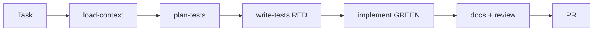
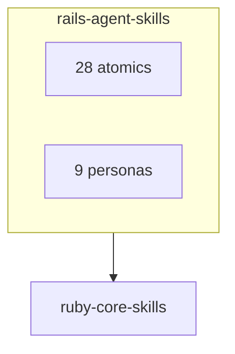

# Rails Agent Skills

This file is the host-context source of truth. `CLAUDE.md` and `GEMINI.md` point here.

Install `igmarin/ruby-core-skills` next to this pack. Skills marked *(from core)* live there.

## Tests gate implementation

Implementation waits until a test exists, has been run, and fails because the feature is missing — not because of a typo or setup error. Wrote code first? Delete it and start over.

```text
plan-tests → write failing test → confirm RED
  → propose implementation → implement → confirm GREEN
  → linters + full suite → write-yard-docs *(from core)* → code-review → PR
```

## Daily loop





## When to load a skill

Read the matching `SKILL.md` before acting. Descriptions are triggers only — the body is the procedure.

### Rails skills

| Skill | Use when |
|-------|----------|
| `load-context` | Existing app. Load schema, routes, one neighbor. |
| `setup-environment` | First-time setup. Do not echo secrets. |
| `plan-tests` | Choosing the first failing spec. |
| `write-tests` | Writing or cleaning RSpec. |
| `test-service` | Service specs under `spec/services/`. |
| `code-review` | Reviewing a Rails PR or diff. |
| `security-check` | XSS, CSRF, SQLi, secrets, auth bypass. |
| `review-architecture` | Fat models/controllers, boundaries. |
| `review-migration` | Production-safe migrations. |
| `apply-stack-conventions` | PostgreSQL + Hotwire + Tailwind. |
| `apply-code-conventions` | DRY/YAGNI/PORO by path. Linter is style SoT. |
| `implement-authorization` | Pundit, CanCanCan, policies. |
| `implement-background-job` | Active Job, Sidekiq, Solid Queue. |
| `implement-graphql` | graphql-ruby schema, resolver, mutation. |
| `implement-hotwire` | Frames, streams, Stimulus. |
| `optimize-performance` | N+1, slow queries, caching. |
| `version-api` | REST v1/v2, deprecation. |
| `seed-database` | Seeds vs fixtures vs factories. |
| `refactor-code` | Structure change, same behavior. |
| `generate-api-collection` | REST collections. Not GraphQL. |
| `create-engine` | Scaffold a Rails engine. |
| `test-engine` | Dummy app and engine specs. |
| `document-engine` | Engine README and install docs. |
| `create-engine-installer` | Install generators. |
| `review-engine` | Engine isolation and host contract. |
| `release-engine` | SemVer release. |
| `extract-engine` | Host feature → engine. |
| `upgrade-engine` | Cross-version compatibility. |

### Personas

| Persona | Loop |
|---------|------|
| `tdd` | test → implement → review → PR |
| `review` | review → deep dive → response |
| `setup` | context → onboarding → CI |
| `quality` | conventions → refactor → docs |
| `engine` | author → test → review → release |
| `bug-fix` | triage → reproduce → fix → verify |
| `graphql` | domain → schema → TDD → security |
| `migration` | plan → test → staging → production |
| `background-job` | design → TDD → retry → monitor |

### From ruby-core-skills

`define-domain-language`, `review-domain-boundaries`, `model-domain`, `create-service-object`, `integrate-api-client`, `implement-calculator-pattern`, `write-yard-docs`, `triage-bug`, `respond-to-review`, `skill-router`, `tdd-process`, `refactor-process`, `review-process`, `security-review-process`, `test-planning-process`, `generate-tdd-tasks`.

## Code defaults

These apply to every `.rb` file this pack produces:

- `# frozen_string_literal: true` on every Ruby file.
- Service result: `{ success: bool, response: { ... } }`. Errors under `response: { error: { message: '...' } }`.
- `rescue StandardError` logs `e.message` and the first five backtrace lines.
- Public methods that can raise get one YARD `@raise` per exception class.
- Time-dependent specs use `travel_to`. Do not stub `Time.now`.
- Jobs: `retry_on` for transient errors, `discard_on` for permanent ones (`ActiveRecord::RecordNotFound`).

Generated artifacts are English unless the user asks for another language.

## Skill descriptions

`description` says when to use the skill and lists trigger words. It does not restate the procedure. Target ≤ 600 characters. Spec hard limit is 1024.

See [docs/architecture.md](docs/architecture.md) and [docs/reference/gaps.md](docs/reference/gaps.md).
