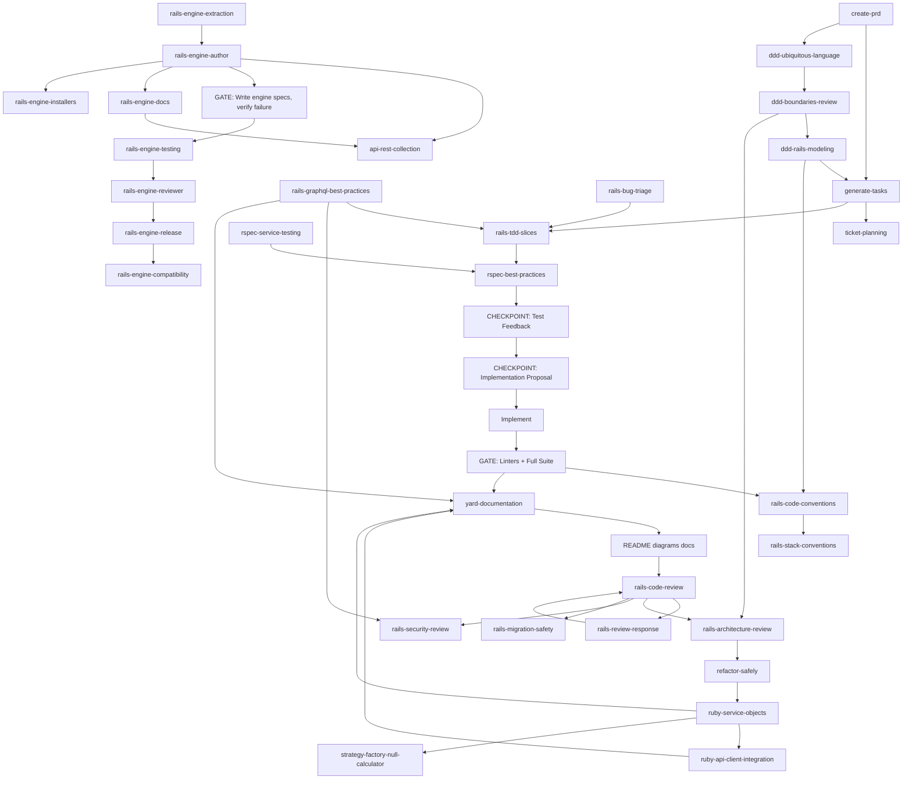

# Rails Agent Skills

> **Rails Agent Skills** is a curated library of AI agent skills for **Ruby on Rails** development. Skills encode specialized knowledge, conventions, and workflow patterns so assistants deliver higher-quality code.

---

[](https://tessl.io/registry/igmarin/rails-agent-skills)

---

- **Repository / install path:** `rails-agent-skills` ([docs/implementation-guide.md](docs/implementation-guide.md))
- **Bootstrap discovery skill:** `[rails-skills-orchestrator](rails-skills-orchestrator/)` (session hook loads `rails-skills-orchestrator/SKILL.md` where applicable)
- **Workflows:** [docs/workflow-guide.md](docs/workflow-guide.md) — **Skill structure:** [docs/architecture.md](docs/architecture.md)
- **How to invoke a skill or workflow:** [docs/workflow-guide.md#how-to-invoke](docs/workflow-guide.md#how-to-invoke-a-skill-or-workflow-claude-code)

## Methodology

This skill library is built on core principles that shape how every skill operates. For detailed guidance on skill design, read the official [Skill Design Principles](docs/skill-design-principles.md).

### 1. Tests Gate Implementation

The central methodology of this project. Tests are not a phase that happens "after" or "alongside" development — they are a **gate** that must be passed before any implementation code can be written.

```text
PRD → Tasks → [GATE] → Implementation → YARD → Docs → Code review → PR
                 │
                 ├── 1. Test EXISTS (written and saved)
                 ├── 2. Test has been RUN
                 └── 3. Test FAILS for the correct reason
                        (feature missing, not a typo)

        Only after all 3 conditions are met
        can implementation code be written.

After tests pass: document public Ruby API (YARD), update README/diagrams/
related docs, then self-review (rails-code-review) before opening the PR.
Task lists from generate-tasks include these steps explicitly.
```

This applies to every skill that produces code: service objects, background jobs, API integrations, engine components, refactoring, and bug fixes. Every implementation skill in this library includes a **HARD-GATE: Tests Gate Implementation** section enforcing this discipline.

Why this matters:

- A test that passes immediately proves nothing — you don't know if it tests the right thing
- A test you never saw fail could be testing existing behavior, not the new feature
- Implementation code written before the test is biased by what you built, not what's required

**Generated output:** All generated artifacts (documentation, YARD comments, Postman collections, examples) must be in **English** unless the user explicitly requests another language. This is reflected in the skill template and in `yard-documentation` and `api-rest-collection`.

### 2. Workflow Chaining

Skills are designed to be used in sequence, not in isolation. Each skill's **Integration** table points to the next skill in the chain. The primary daily workflow is:

```text
rails-tdd-slices → rspec-best-practices (write failing test)
    ↓
[CHECKPOINT: Test Design Review — confirm boundary, behavior, edge cases]
    ↓
[CHECKPOINT: Implementation Proposal — confirm approach before coding]
    ↓
Implement (minimal code to pass test) → Refactor
    ↓
[GATE: Linters + Full Test Suite]
    ↓
yard-documentation → Update docs
    ↓
rails-code-review (self-review) → rails-review-response (on feedback)
    ↓
PR
```

See [docs/workflow-guide.md](docs/workflow-guide.md) for the full TDD Feature Loop and all workflow diagrams.

**Note:** `ticket-planning` is an **optional** step. The assistant should **not** push for Jira ticket generation unless the user asks explicitly (e.g. "turn this into Jira tickets") or the context clearly indicates work should be mapped to a Jira board/sprint.

### 3. Rails-First Pattern Reuse

This library intentionally reuses proven patterns from broader agent-skill libraries, but translates them into a **Rails-first** workflow instead of copying generic frontend-oriented skills one-to-one.


| Reused pattern                         | Rails-first destination in this repo                                       |
| -------------------------------------- | -------------------------------------------------------------------------- |
| PRD interview + scope control          | `create-prd`                                                               |
| Planning from requirements             | `generate-tasks`                                                           |
| TDD loop and smallest safe slice       | `rspec-best-practices` + `rails-tdd-slices`                                |
| Bug investigation to reproducible test | `rails-bug-triage`                                                         |
| Domain language and context design     | `ddd-ubiquitous-language` + `ddd-boundaries-review` + `ddd-rails-modeling` |
| Skill authoring conventions            | `docs/skill-template.md`                                                   |


The rule of thumb is: **reuse patterns, not names**. If a broader skill maps cleanly to Rails/RSpec/YARD workflows, absorb the pattern into the existing chain. Create a new skill only when there is a real Rails-specific workflow gap.

## How to Build a Feature (Your Daily Workflow)

*For a practical guide on how to talk to the AI and effectively invoke these workflows, please see our **[How to Invoke a Workflow Guide](docs/workflow-guide.md#how-to-invoke-a-workflow-a-practical-guide)**.*

Here is the recommended, step-by-step workflow for building a new feature from scratch using this skill library. This ensures every feature is well-planned, robustly tested, and adheres to project quality standards.

**Goal:** Build a new feature, e.g., "Feature A"

**Step 1: Planning & Task Breakdown**

- **Action:** Define the feature's requirements.
  - **Use Skill:** [create-prd](create-prd/)
- **Then:** Break the PRD into a detailed, TDD-ready checklist.
  - **Use Skill:** [generate-tasks](generate-tasks/)

**Step 2: Start the TDD Cycle**

- **Action:** Pick the first, highest-value "slice" of behavior from your task list.
- **Action:** Get guidance on choosing the right *type* of test to write first (e.g., a request spec).
  - **Use Skill:** [rails-tdd-slices](rails-tdd-slices/)
- **Action:** Write the first failing test. **Crucially, run it and watch it fail.**
  - **Use Skill:** [rspec-best-practices](rspec-best-practices/)

**Step 3: Implementation**

- **Action:** Write the minimum amount of application code required to make your failing test pass.
  - **Use Skills:** [ruby-service-objects](ruby-service-objects/) for business logic, [rails-code-conventions](rails-code-conventions/) for general code quality.

**Step 4: Verification**

- **Action:** Run the test again and watch it pass.
- **Action:** Run linters and the full test suite to ensure no regressions. Refactor your new code if needed.

**Step 5: Documentation & Self-Review**

- **Action:** Add inline documentation to any new public classes or methods.
  - **Use Skill:** [yard-documentation](yard-documentation/)
- **Action:** Perform a self-review of your changes.
  - **Use Skill:** [rails-code-review](rails-code-review/)

**Step 6: Responding to Peer Review**

- **Action:** When you receive feedback from teammates, evaluate and implement their suggestions systematically.
  - **Use Skill:** [rails-review-response](rails-review-response/)

*For more detailed diagrams of these flows, see the **[Workflow Guide](docs/workflow-guide.md)**.*

## Platforms & Quick Start

To integrate these skills with your preferred AI development environment (such as Gemini CLI, Cursor, Windsurf, Claude Code, Codex, or RubyMine), please refer to the **[Implementation Guide](docs/implementation-guide.md)**.

This guide provides detailed, step-by-step instructions for both the symlink-based and the recommended Model Context Protocol (MCP) server approaches for each platform.

## Skills Catalog

### Planning & Tasks


| Skill                               | Description                                                                  |
| ----------------------------------- | ---------------------------------------------------------------------------- |
| [create-prd](create-prd/)           | Generate Product Requirements Documents from feature descriptions            |
| [generate-tasks](generate-tasks/)   | Break down PRDs into step-by-step implementation task lists                  |
| [ticket-planning](ticket-planning/) | Draft or create Jira tickets from plans; sprint placement and classification |


### Rails Code Quality


| Skill                                                         | Description                                                                                              |
| ------------------------------------------------------------- | -------------------------------------------------------------------------------------------------------- |
| [rails-code-review](rails-code-review/)                       | Review Rails code following The Rails Way conventions — giving a review                                  |
| [rails-review-response](rails-review-response/)               | Respond to review feedback — evaluate, push back, implement safely, trigger re-review                    |
| [rails-architecture-review](rails-architecture-review/)       | Review application structure, boundaries, and responsibilities                                           |
| [rails-security-review](rails-security-review/)               | Audit for auth, XSS, CSRF, SQLi, and other vulnerabilities                                               |
| [rails-migration-safety](rails-migration-safety/)             | Plan production-safe database migrations                                                                 |
| [rails-stack-conventions](rails-stack-conventions/)           | Apply Rails + PostgreSQL + Hotwire + Tailwind conventions                                                |
| [rails-code-conventions](rails-code-conventions/)             | Daily coding checklist: DRY/YAGNI/PORO/CoC/KISS; linter as style SoT; structured logging; per-path rules |
| [rails-background-jobs](rails-background-jobs/)               | Design idempotent background jobs with Active Job / Solid Queue                                          |
| [rails-graphql-best-practices](rails-graphql-best-practices/) | GraphQL schema design, N+1 prevention, authorization, error handling, and testing with graphql-ruby      |
| [api-rest-collection](api-rest-collection/)                   | Generate or update Postman Collection (JSON v2.1) for REST endpoints; use Insomnia for GraphQL           |


### DDD & Domain Modeling


| Skill                                               | Description                                                                                        |
| --------------------------------------------------- | -------------------------------------------------------------------------------------------------- |
| [ddd-ubiquitous-language](ddd-ubiquitous-language/) | Build a shared domain glossary, resolve synonyms, and clarify business terminology                 |
| [ddd-boundaries-review](ddd-boundaries-review/)     | Review bounded contexts, ownership, and language leakage in Rails codebases                        |
| [ddd-rails-modeling](ddd-rails-modeling/)           | Map DDD concepts to Rails models, services, value objects, and boundaries without over-engineering |


### Ruby Patterns


| Skill                                                                 | Description                                                                  |
| --------------------------------------------------------------------- | ---------------------------------------------------------------------------- |
| [ruby-service-objects](ruby-service-objects/)                         | Build service objects with .call, standardized responses, transactions       |
| [ruby-api-client-integration](ruby-api-client-integration/)           | Integrate external APIs with the layered Auth/Client/Fetcher/Builder pattern |
| [strategy-factory-null-calculator](strategy-factory-null-calculator/) | Implement variant-based calculators with Strategy + Factory + Null Object    |
| [yard-documentation](yard-documentation/)                             | Write YARD docs for Ruby classes and public methods (all output in English)  |


### Testing


| Skill                                           | Description                                                                |
| ----------------------------------------------- | -------------------------------------------------------------------------- |
| [rspec-best-practices](rspec-best-practices/)   | Write maintainable, deterministic RSpec tests with TDD discipline          |
| [rails-tdd-slices](rails-tdd-slices/)           | Pick the best first failing spec for a Rails change before implementation  |
| [rails-bug-triage](rails-bug-triage/)           | Turn a Rails bug report into a reproducible failing spec and fix plan      |
| [rspec-service-testing](rspec-service-testing/) | Test service objects with instance_double, hash factories, shared_examples |


### Rails Engines


| Skill                                                     | Description                                                       |
| --------------------------------------------------------- | ----------------------------------------------------------------- |
| [rails-engine-author](rails-engine-author/)               | Design and scaffold Rails engines with proper namespace isolation |
| [rails-engine-testing](rails-engine-testing/)             | Set up dummy apps and engine-specific specs                       |
| [rails-engine-reviewer](rails-engine-reviewer/)           | Review engine architecture, coupling, and maintainability         |
| [rails-engine-release](rails-engine-release/)             | Prepare versioned releases with changelogs and upgrade notes      |
| [rails-engine-docs](rails-engine-docs/)                   | Write comprehensive engine documentation                          |
| [rails-engine-installers](rails-engine-installers/)       | Create idempotent install generators                              |
| [rails-engine-extraction](rails-engine-extraction/)       | Extract host app code into engines incrementally                  |
| [rails-engine-compatibility](rails-engine-compatibility/) | Maintain cross-version compatibility                              |


### Refactoring


| Skill                               | Description                                                      |
| ----------------------------------- | ---------------------------------------------------------------- |
| [refactor-safely](refactor-safely/) | Restructure code with characterization tests and safe extraction |


### Meta


| Skill                                            | Description                                                    |
| ------------------------------------------------ | -------------------------------------------------------------- |
| [rails-skills-orchestrator](rails-skills-orchestrator/) | Discover and invoke the right skill for the current Rails task |
| [docs/skill-template.md](docs/skill-template.md) | Authoring template and checklist for expanding the library     |


## Skill Relationships




## How Skills Work

Each skill is a `SKILL.md` file in its own directory. For detailed conventions and structure, refer to the [Skill Design Principles](docs/skill-design-principles.md).

## Typical Workflows

Tests are a **gate** between planning and implementation. See [docs/workflow-guide.md](docs/workflow-guide.md) for full diagrams.


| Workflow                                        | Skill Chain                                                                                                                                                                                                               |
| ----------------------------------------------- | ------------------------------------------------------------------------------------------------------------------------------------------------------------------------------------------------------------------------- |
| **TDD Feature Loop** *(primary daily workflow)* | rails-tdd-slices → **[Test Feedback checkpoint]** → **[Implementation Proposal checkpoint]** → implement → **[Linters + Suite gate]** → yard-documentation → rails-code-review → rails-review-response (on feedback) → PR |
| **New feature**                                 | create-prd → generate-tasks → (optional **ticket-planning**) → *TDD Feature Loop*                                                                                                                                         |
| **DDD-first feature**                           | create-prd → ddd-ubiquitous-language → ddd-boundaries-review → ddd-rails-modeling → generate-tasks → *TDD Feature Loop*                                                                                                   |
| **Bug fix**                                     | rails-bug-triage → rails-tdd-slices → **[write reproduction spec, verify failure]** → fix → verify passes → rails-code-review                                                                                             |
| **Code review + response**                      | rails-code-review → rails-review-response (on feedback) → re-review if Critical items addressed                                                                                                                           |
| **Security audit**                              | rails-security-review → rails-code-review (verify fixes) → PR                                                                                                                                                             |
| **Performance optimization**                    | rails-code-conventions (ActiveRecord rules) → **[regression spec]** → optimize → rails-code-review                                                                                                                        |
| **Migration**                                   | rails-migration-safety → **[test up + down]** → implement → rails-code-review                                                                                                                                             |
| **GraphQL feature**                             | ddd-ubiquitous-language → rails-graphql-best-practices → *TDD Feature Loop* → rails-security-review                                                                                                                       |
| **New engine**                                  | rails-engine-author → **[write specs, verify failure]** → implement → rails-engine-docs                                                                                                                                   |
| **Refactoring**                                 | refactor-safely → **[characterization tests]** → refactor → verify tests pass                                                                                                                                             |
| **New service**                                 | rails-tdd-slices → **[write .call spec, verify failure]** → ruby-service-objects → verify passes                                                                                                                          |
| **API integration**                             | rails-tdd-slices → **[write layer specs, verify failure]** → ruby-api-client-integration → verify passes                                                                                                                  |


## Creating New Skills

For guidance on skill authoring, refer to the [Skill Design Principles](docs/skill-design-principles.md) and the [Skill Template](docs/skill-template.md).

## Acknowledgments

Huge thanks to **[Mumo Carlos (@mumoc)](https://github.com/mumoc)**. His mentorship has shaped my growth as a developer and influenced many of the habits and practices reflected in this library — not only the **ticket-planning** workflow he shared, but the broader discipline around quality, clarity, and thoughtful use of tools. This repo and the learning behind it would not be what they are without him.
