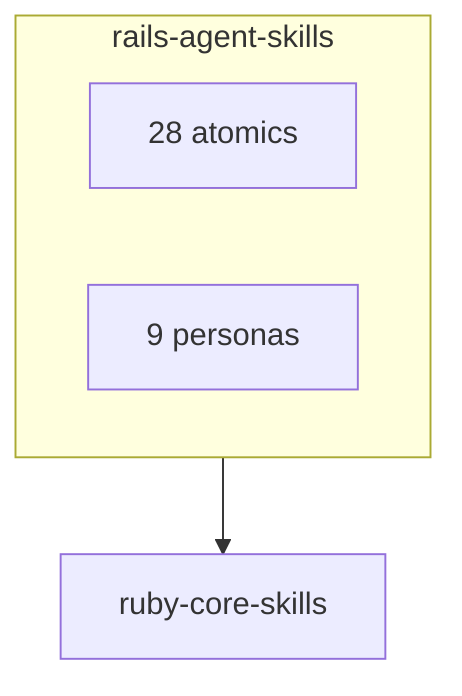
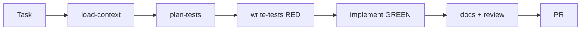

# Rails Agent Skills

A catalog of **28 Rails skills** and **9 personas** that teach agents how to test, implement, and review Rails work. Process skills (TDD gates, YARD, DDD, service objects) live in [`ruby-core-skills`](https://github.com/igmarin/ruby-core-skills). Install both.

```text
Write the test → run it → confirm it fails for the right reason → implement → confirm it passes
```


```mermaid
flowchart TB
  subgraph thisRepo[rails-agent-skills]
    atomics[28 atomics]
    personas[9 personas]
  end
  core[ruby-core-skills]
  thisRepo --> core
```

Also in the same ecosystem: [`hanakai-yaku`](https://github.com/igmarin/hanakai-yaku), [`agnostic-planning-skills`](https://github.com/igmarin/agnostic-planning-skills), [`agent-mcp-runtime`](https://github.com/igmarin/agent-mcp-runtime), [`ruby-skill-bench`](https://github.com/igmarin/ruby-skill-bench).

## Daily loop


```mermaid
flowchart LR
  A[Task] --> B[load-context]
  B --> C[plan-tests]
  C --> D[write-tests RED]
  D --> E[implement GREEN]
  E --> F[docs + review]
  F --> G[PR]
```

Name the persona when you want the whole chain: `tdd`, `bug-fix`, `graphql`, `migration`, `background-job`, `engine`, `review`, `quality`, `setup`.

See [docs/persona-guide.md](docs/persona-guide.md) and [docs/personas/](docs/personas/).

## Catalog

| Area | Skills |
|------|--------|
| Testing | `plan-tests`, `write-tests`, `test-service` |
| Quality | `code-review`, `security-check`, `review-architecture`, `apply-code-conventions`, `apply-stack-conventions`, `implement-authorization`, `refactor-code` |
| Engines | `create-engine`, `test-engine`, `document-engine`, `review-engine`, `release-engine`, `create-engine-installer`, `extract-engine`, `upgrade-engine` |
| Infrastructure | `review-migration`, `implement-background-job`, `seed-database`, `optimize-performance`, `version-api`, `implement-hotwire` |
| API | `generate-api-collection`, `implement-graphql` |
| Context | `load-context`, `setup-environment` |

Core skills (install separately): `triage-bug`, `respond-to-review`, `write-yard-docs`, `create-service-object`, `integrate-api-client`, `define-domain-language`, `model-domain`, `skill-router`, and the process skills.

Full list: [docs/reference/skill-catalog.md](docs/reference/skill-catalog.md). Gaps: [docs/reference/gaps.md](docs/reference/gaps.md).

## Install

```bash
npx skills add igmarin/ruby-core-skills
npx skills add igmarin/rails-agent-skills
```

Or with GitHub CLI v2.90.0+ (`gh skill`):

```bash
gh skill install igmarin/ruby-core-skills
gh skill install igmarin/rails-agent-skills
gh skill install igmarin/rails-agent-skills code-review --scope project
```

A PromptScript global-install warning from `skills.sh` is harmless. The skills still install for other hosts.

## Docs

| Need | Document |
|------|----------|
| Host context | [AGENTS.md](AGENTS.md) |
| How to invoke a persona | [docs/persona-guide.md](docs/persona-guide.md) |
| Skill layout | [docs/architecture.md](docs/architecture.md) |
| Eval ownership | [docs/eval-provenance.md](docs/eval-provenance.md) |

## Contributing

- Artifacts in English unless the user asks otherwise.
- Keep the tests-gate rule on every code-producing skill.
- `description` is when + triggers (≤ 600 chars). Procedure stays in the body.
- Keep public docs in sync with `directory.json`.

Thanks to [Mumo Carlos (@mumoc)](https://github.com/mumoc).
