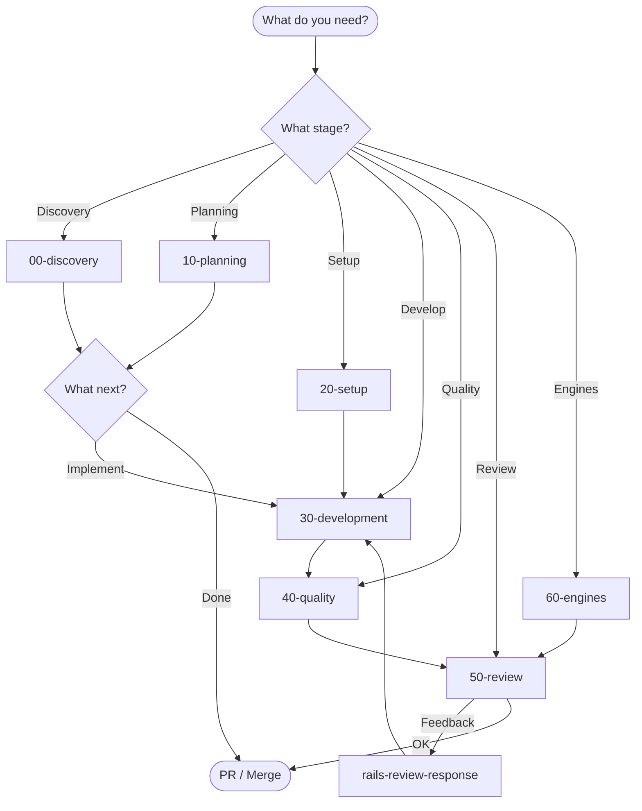

# Rails Agent Skills — Documentation

> This is not just documentation — it is the operating system behind AI-driven Rails development.
>
> Rails Agent Skills defines how AI agents should **think, plan, and execute** across the entire software lifecycle — from discovery to PR — with strict workflows and TDD as a non-negotiable quality gate.

Master index for all project documentation.

---

## What this gives you

- A complete, structured workflow system (Discovery → PR)
- 30+ production-grade skills with clear triggers and responsibilities
- Enforced TDD workflows (tests as a hard gate, not a suggestion)
- Context-aware orchestration across tasks and agents
- A repeatable way to turn AI into a reliable engineering system

This documentation is your entry point to understanding and applying that system.

## 🚀 Start Here

Think of this as a decision map — not just docs. Pick your current stage and follow the workflow.

| If you are... | Go to... |
|---------------|----------|
| **New to the project** | [Quick Start](#quick-start) → [Workflows Discovery](workflows/00-discovery.md) |
| **Developer looking for workflow** | [Workflows Index](workflows/) — All flows by stage |
| **Skill contributor** | [Skill Design Principles](skill-design-principles.md) |
| **Debugging integration** | [Implementation Guide](implementation-guide.md) |

---

## Quick Start

If you're using AI agents in Rails, start here. This gives you the fastest path to the right workflow without guessing.

### 30 Seconds: Which Skill to Use

```text
New to project?          → rails-context-engineering
Plan a feature?          → create-prd → generate-tasks
Start coding?            → rails-tdd-slices → rspec-best-practices
Fix a bug?               → rails-bug-triage
Refactor?                → refactor-safely
Code review?             → rails-code-review
Not sure?                → rails-skills-orchestrator
```

### Master Flow Diagram



---

## Workflows by Stage

Each workflow is designed to be executed by an AI agent (or human + AI) with clear steps, inputs, and expected outputs.

Step-by-step workflows for each development phase:

| Stage | Document | Description |
|-------|----------|-------------|
| **00** | [Discovery & Context](workflows/00-discovery.md) | Understand codebase, onboarding |
| **10** | [Planning & Design](workflows/10-planning.md) | PRD, tasks, DDD |
| **20** | [Setup & Configuration](workflows/20-setup.md) | CI/CD, dev environment |
| **30** | [Development](workflows/30-development.md) | TDD, implementation, bug fixes |
| **40** | [Code Quality](workflows/40-quality.md) | Conventions, refactoring, docs |
| **50** | [Review & Validation](workflows/50-review.md) | Code review, security, architecture |
| **60** | [Engines](workflows/60-engines.md) | Rails engines development |

**Complete index:** [workflows/README.md](workflows/README.md)

---

## Reference

### Skill Catalog

Complete catalog of 34+ skills organized by stage:

- **[skill-catalog.md](reference/skill-catalog.md)** — List with descriptions and triggers
- **[integration-matrix.md](reference/integration-matrix.md)** — Which skill connects to which

### Principles & Architecture

| Document                                                   | Content                                                                                                 |
| ------------------------------------------------------------| ---------------------------------------------------------------------------------------------------------|
| [skill-design-principles.md](skill-design-principles.md)   | 6 skill design principles                                                                               |
| [skill-optimization-guide.md](skill-optimization-guide.md) | Eval-driven loop: baseline-vs-context targets, per-skill scoring, what to change when a skill regresses |
| [architecture.md](architecture.md)                         | SKILL.md structure, frontmatter, checkpoints                                                            |
| [skill-template.md](skill-template.md)                     | Template for new skills                                                                                 |

---

## Guides

In-depth guides by specific topic:

| Guide | Topic |
|-------|-------|
| **implementation-guide.md** | Installation on Claude, Cursor, Gemini |
| **workflow-guide.md** | Narrative companion to `workflows/` — full TDD Feature Loop, planning, bug fix, GraphQL, engine, migration, refactor, performance, perf optimization, and external API chains in one file |
| **plugin-validation.md** | Plugin validation for different IDEs |
| **vs-code-setup.md** | VS Code specific configuration |

---

## Tests Gate Implementation

Non-negotiable principle across all workflows:

```text
Write test → Run test → Verify it FAILS → Implement → Verify it PASSES
```

See details in each specific workflow.

---

## External Links

- **Repository:** [github.com/igmarin/rails-agent-skills](https://github.com/igmarin/rails-agent-skills)
- **Tessl Registry:** [tessl.io](https://tessl.io)

---

## File Structure

```text
docs/
├── README.md                    # This file — master index
├── skill-design-principles.md   # Design principles
├── skill-template.md            # Template for skills
├── architecture.md            # SKILL.md conventions
├── implementation-guide.md    # IDE installation
├── plugin-validation.md       # Plugin validation
├── vs-code-setup.md          # VS Code specific
│
├── workflows/                 # Workflows by stage (new)
│   ├── README.md
│   ├── 00-discovery.md
│   ├── 10-planning.md
│   ├── 20-setup.md
│   ├── 30-development.md
│   ├── 40-quality.md
│   ├── 50-review.md
│   └── 60-engines.md
│
├── reference/                 # Quick reference (new)
│   ├── skill-catalog.md
│   └── integration-matrix.md
│
└── guides/                    # Deep guides (future)
```

---

## Documentation Roadmap

- [x] Reorganize workflows into separate files
- [x] Create skill-catalog.md
- [x] Create integration-matrix.md
- [ ] Migrate legacy content from workflow-guide.md
- [ ] Create specific guides (authorization, performance, etc.)

---

**Note:** This documentation is constantly evolving. If you find something confusing or missing, please open an issue in the repository.
