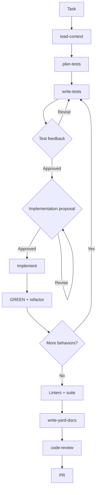
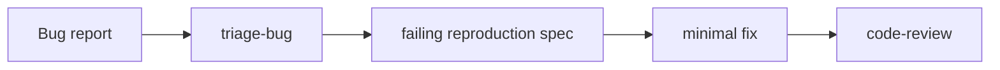
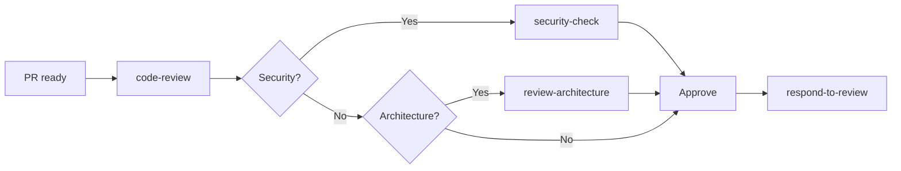
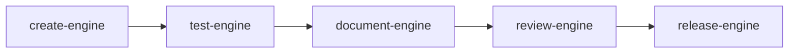
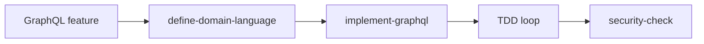
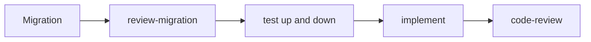

# Persona Guide

How to chain skills. Install notes are in the [README](../README.md). `SKILL.md` rules are in [architecture.md](architecture.md).

## How to invoke

State the goal and name the persona or skill:

```text
Add a status column to orders. Follow review-migration.
Follow the TDD persona for the user profile page.
Use triage-bug *(from core)* on this avatar bug.
```

Checkpoints in the TDD loop wait for you. Say “skip the proposal” if you already know the approach.

Stage write-ups: [docs/personas/](personas/).

## TDD feature loop



Details: [personas/development.md](personas/development.md).

## Other loops











| Need | Guide |
|------|-------|
| Discovery | [personas/discovery.md](personas/discovery.md) |
| Setup | [personas/setup.md](personas/setup.md) |
| Development | [personas/development.md](personas/development.md) |
| Quality | [personas/quality.md](personas/quality.md) |
| Review | [personas/review.md](personas/review.md) |
| Engines | [personas/engines.md](personas/engines.md) |

## Tests gate

A test must exist, run, and fail because the feature is missing before any implementation. That rule is in [AGENTS.md](../AGENTS.md). Skills add only the extra gates that belong to that skill.
