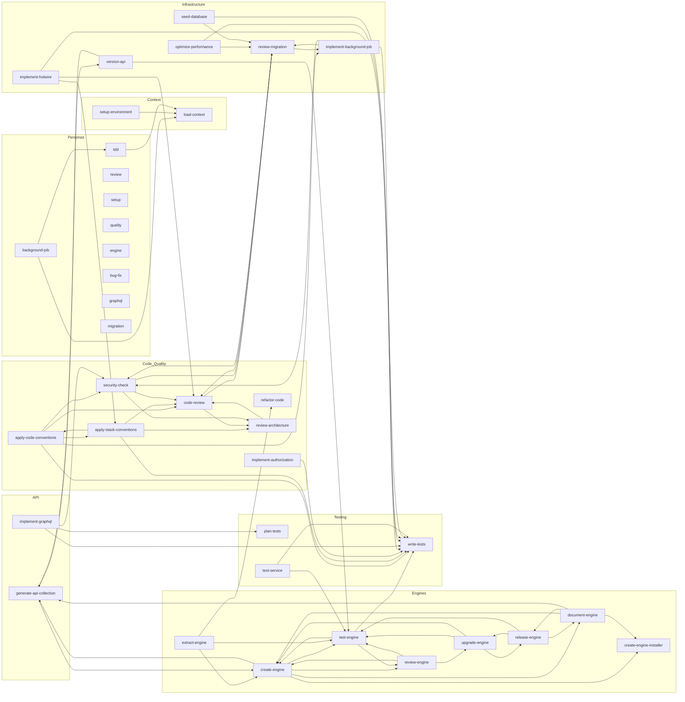

# Skill Graph

Generated from `directory.json`, `skills.sh.json`, and each skill's `## Integration` table. Run `./scripts/render-skill-graph.sh` to regenerate.

## Catalog Graph

## Notes

- Edges are drawn from each skill's `## Integration` table (predecessor/successor references).
- Only local skills in `directory.json` appear as nodes. Skills moved to `ruby-core-skills` (see `deprecated_skills` in `directory.json`) are not drawn — they live in a separate repo.
- Self-references are skipped. Duplicate edges are not deduplicated by Mermaid.
- Regenerate with `./scripts/render-skill-graph.sh`. Run `./scripts/render-skill-graph.sh --check` in CI to fail on drift.
