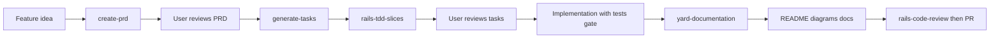
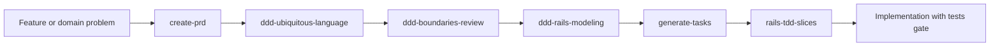
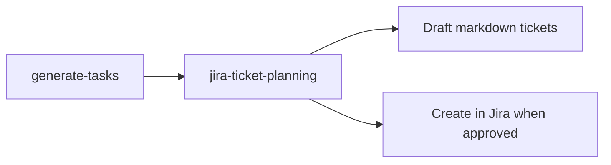
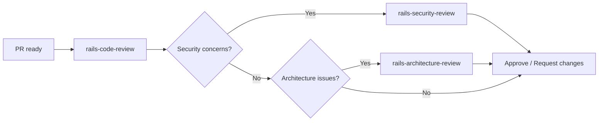
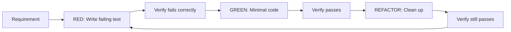
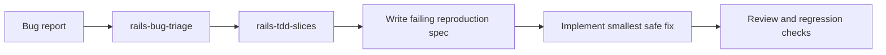
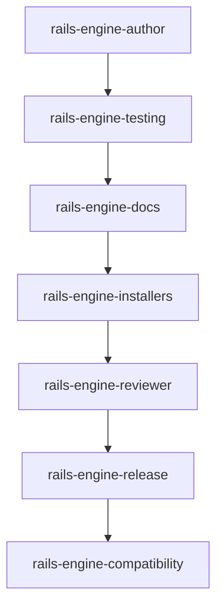
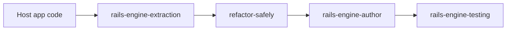
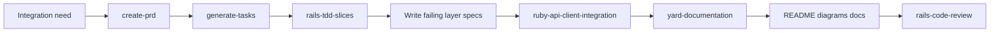
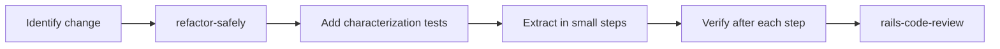

# Workflow Guide — Rails Agent Skills

Companion to the [README](../README.md): **how to chain skills** in typical Rails workflows. For install paths and hooks, see [implementation-guide.md](implementation-guide.md). For `SKILL.md` structure and frontmatter rules, see [architecture.md](architecture.md).

## Cross-Cutting Rule: Tests Gate Implementation

**Tests are a gate between planning and code.** Once a PRD and tasks exist, the test for each behavior must be written, run, and validated as failing BEFORE any implementation code is written.

```text
PRD → Tasks → Choose first slice → [GATE: Write test → Run test → Verify it fails] → Implementation → Verify passes
  → YARD (public API) → Update README / diagrams / domain docs → Self code review → PR
```

The gate is non-negotiable. Implementation code cannot exist before its test has been:

1. Written and saved
2. Executed
3. Confirmed failing because the feature does not exist yet

See **`rspec-best-practices`** for the full gate cycle (red → green → refactor).

## Planning a New Feature



1. **create-prd**: Describe the feature. The skill generates a PRD with goals, user stories, functional requirements, and success metrics. Saved to `/tasks/prd-[feature-name].md`.

2. **generate-tasks**: Point to the PRD. The skill breaks it into parent tasks and sub-tasks with exact file paths, including **YARD**, **documentation updates**, and **code review before PR**. It can also produce a phased plan when the user wants strategy first. Saved to `/tasks/tasks-[feature-name].md`.

3. **rails-tdd-slices**: Choose the highest-value first failing spec before implementation starts.

4. **Implementation**: Follow the task list with the **tests gate** (write test → run → fail → implement → pass).

5. **yard-documentation**: Add or update YARD on every new or changed public class/method (English).

6. **Docs**: Update README, architecture diagrams, and any domain docs affected by the change.

7. **rails-code-review**: Self-review the full diff, then open the PR (use security/architecture skills when needed).

**Key rules:**

- Do NOT implement until the PRD is approved
- Each sub-task should take 2-5 minutes
- Task 0.0 is always "Create feature branch"
- Do not skip YARD, doc updates, or self-review — they are explicit task parents, not optional polish

## DDD-First Feature Design

Use this workflow when the hard part is the **domain itself**: unclear business language, conflicting meanings, fuzzy ownership, or uncertainty about whether something belongs in a model, value object, or service.



1. **create-prd**: Capture the feature outcome, goals, non-goals, and business rules first.
2. **ddd-ubiquitous-language**: Build the glossary, choose canonical terms, and surface overloaded words.
3. **ddd-boundaries-review**: Check whether the feature crosses bounded contexts, leaks language, or hides ownership problems.
4. **ddd-rails-modeling**: Decide the Rails-first tactical design: model, value object, service, repository, event, or simpler alternative.
5. **generate-tasks**: Turn the design into an implementation plan or detailed checklist.
6. **rails-tdd-slices**: Choose the best first failing spec before code is written.
7. **Implementation**: Follow the normal **tests gate**, then YARD, docs, and review.

**Key rules:**

- Start with language and invariants, not patterns
- Do not introduce repositories or domain events unless the boundary pressure is real
- Prefer the smallest credible boundary improvement over a DDD rewrite
- Chain back to `rails-architecture-review` or `refactor-safely` when the domain problem lives in existing code structure

### Optional: Jira tickets from the plan

When the team tracks work in **Jira**, run **jira-ticket-planning** after **generate-tasks** (or from any approved initiative plan):



- Use it for **draft-only** output (markdown tickets, classification, sprint buckets) or **create-in-Jira** after the user confirms project, issue types, and fields.
- It does not replace the PRD/tasks artifacts; it **maps** planning output to board-ready tickets.

---

## Where principles apply in the flow

**After** the **tests gate** is satisfied for a given behavior, **implementation** should follow:

1. **rails-principles-and-boundaries** — DRY/YAGNI/PORO/CoC/KISS; project linter as style SoT; structured logging; rules by path (`app/services`, workers, controllers, etc.).
2. **rails-stack-conventions** — Stack-specific defaults (PostgreSQL, Hotwire, Tailwind).

Use **rails-principles-and-boundaries** during **code review** and **refactors** as well, not only on greenfield features.

When the main issue is domain language or ownership, run `ddd-ubiquitous-language` and `ddd-boundaries-review` before deciding on Rails tactical modeling.

---

## Code Review

**Before opening a PR:** run **rails-code-review** on your own branch (same checklist as reviewing others). Task lists from **generate-tasks** end with this step.



1. **rails-code-review**: Systematic review across routing, controllers, models, queries, migrations, security, caching, and testing.

2. **rails-security-review**: Deep dive on auth, params, redirects, output encoding, and secrets.

3. **rails-architecture-review**: Structural review of boundaries, responsibilities, and abstraction quality.

**Key rules:**

- Use severity levels: Critical / Suggestion / Nice to have
- When receiving feedback: verify before implementing, no performative agreement
- Push back with technical reasoning when feedback is incorrect

---

## Writing Tests (TDD)



1. **rails-tdd-slices**: Use first when the right starting spec is not obvious. It helps pick the best initial failing spec for request, model, service, job, engine, or bug-fix work.

2. **rspec-best-practices**: Covers the full TDD cycle, spec type selection, factory design, and common smells.

3. **rspec-service-testing**: Specific patterns for service object tests — instance_double, hash factories, shared_examples.

**Key rules:**

- No production code without a failing test first
- If code exists before the test, delete it and start over
- Run tests after EVERY step

### Bug Triage Before Fixing



1. **rails-bug-triage**: Clarify expected vs actual behavior, narrow the affected layer, and identify the highest-value reproduction path.
2. **rails-tdd-slices**: Decide the strongest first failing spec for the bug.
3. **rspec-best-practices**: Run the red-green-refactor loop after the reproduction spec is chosen.

---

## Building a Rails Engine



1. **rails-engine-author**: Choose engine type, set up namespace isolation, define host contract.
2. **rails-engine-testing**: Create dummy app, add request/routing/generator specs.
3. **rails-engine-docs**: Write README with installation, mounting, configuration, usage (all in English).
4. **rails-engine-installers**: Create idempotent install generators.
5. When the engine exposes HTTP endpoints, use **api-postman-collection** to generate or update a Postman Collection (JSON v2.1) for testing.
6. **rails-engine-reviewer**: Review the complete engine for quality.
7. **rails-engine-release**: Prepare versioned release with changelog.

---

## Documentation and API Testing

**Generated output:** All documentation, YARD comments, Postman collections, and examples must be in **English** unless the user explicitly requests another language.

**Post-implementation (not optional for features):** After implementation and green tests, **yard-documentation** runs on the touched public API; then update **README**, **diagrams** (e.g. Mermaid in `docs/`), and **related domain docs** so operators and future developers see the new behavior.

1. **yard-documentation**: Use when writing or reviewing inline docs for Ruby classes and public methods. Apply YARD tags (`@param`, `@option`, `@return`, `@raise`, `@example`) on every public method; keep all text in English. **Required before PR** for new or changed public API.
2. **api-postman-collection**: Use when creating or modifying API endpoints (Rails controllers, engine routes). Generate or update a Postman Collection JSON (v2.1) so the flow can be tested; store it in e.g. `docs/postman/` or `spec/fixtures/postman/`. Request names and descriptions in English.

---

## Extracting to an Engine



1. **rails-engine-extraction**: Identify bounded feature, list host dependencies, create adapters.
2. **refactor-safely**: Characterization tests first, then extract in small steps.
3. **rails-engine-author**: Scaffold the engine properly.
4. **rails-engine-testing**: Verify behavior is preserved.

**Key rules:**

- Do NOT extract and change behavior in the same step
- Add characterization tests before any extraction
- Use adapters for host dependencies

---

## Creating Service Objects

1. **ruby-service-objects**: Follow `.call` pattern, standardized responses, YARD docs (see **yard-documentation**), transaction wrapping.
2. **rspec-service-testing**: Test with subject/let, instance_double, change matchers, error scenarios.

For inline documentation standards, use **yard-documentation**. For external API integrations, add **ruby-api-client-integration** (Auth/Client/Fetcher/Builder layers).

For variant-based calculators, add **strategy-factory-null-calculator** (Factory + Strategy + Null Object).

---

## External API Integration



1. **create-prd**: Capture the business need, external dependency, side effects, and success criteria.
2. **generate-tasks**: Break the integration into layers and explicit verification steps.
3. **rails-tdd-slices**: Decide the strongest first failing spec, usually at the auth, client, fetcher, builder, or mapping boundary.
4. **ruby-api-client-integration**: Implement the layered Rails-first client structure with retries, pagination, token handling, and domain mapping where needed.
5. **yard-documentation**: Document public Ruby API exposed by the integration layer.
6. **Docs**: Update README and any operator or integration docs affected by setup, credentials flow, or usage.
7. **rails-code-review**: Review reliability, layering, and failure handling before PR.

**Key rules:**

- Start with a failing spec for the riskiest layer, not with ad-hoc request code
- Keep auth, transport, fetching, and mapping responsibilities explicit
- Prefer domain mapping over leaking raw external payloads deep into the app
- Document setup and operational expectations when the integration changes developer or operator workflow

---

## Refactoring Existing Code



1. **refactor-safely**: Define stable behavior, add characterization tests, extract one boundary at a time.
2. **rspec-best-practices**: Write the tests that protect the refactoring.
3. **rails-code-review**: Review the refactored code.

**Key rules:**

- Separate behavior changes from structural changes
- Verify tests pass after EVERY refactoring step
- Evidence before claims — run the test suite, don't assume
