# Workflow Guide — Rails Agent Skills

Companion to the [README](../README.md): **how to chain skills** in typical Rails workflows. For install paths and hooks, see [implementation-guide.md](implementation-guide.md). For `SKILL.md` structure and frontmatter rules, see [architecture.md](architecture.md).

---

## How to Invoke a Workflow: A Practical Guide

The key to using this skill library effectively is to guide the AI by **stating your goal** and then **explicitly referencing the workflow or skill** you want it to follow. This tells the AI *what* to do and *how* to do it according to the expert rules we've defined.

### The Golden Rule: State the Goal, and Name the Workflow

The most effective way to invoke a workflow is to follow this general formula:

**`"[Your Goal]"`** + **`"following the [Skill Name / Workflow Name] process."`**

By doing this, you turn a simple request into a robust, professional workflow, ensuring any AI—smart or not—is constrained to follow our best practices.

### Example 1: A Safe Database Migration

*   **A Naive Request (What to Avoid):**
    > *"Hey, create a migration adding a new column `status` to the `orders` table with a default value of `'pending'` and `null: false`."*
    >
    > **Risk:** This could generate a single, dangerous migration that locks your production `orders` table.

*   **An Expert Request (What to Do):**
    > *"I need to add a `status` column to the `orders` table with a default of `'pending'`. **Please follow the `rails-migration-safety` skill to do this.**"*
    >
    > **Expected Result:** The AI should respond by outlining a safe, multi-step migration process (add nullable column, backfill data in a separate task, then add the constraint in a final migration).

### Example 2: Generalizing the Pattern

This formula works for any task:

*   **For a new feature:**
    > *"Let's start building the 'user profile page' **following our TDD workflow**."*

*   **For a bug fix:**
    > *"I've got a bug report about avatars. Let's use the **`rails-bug-triage` skill** to create a failing test for it."*

*   **For a refactor:**
    > *"This controller is getting too big. I want to extract a service object **using the `refactor-safely` skill**."*

You, the human, are the project lead. Your job is to set the direction and point the AI to the right set of internal "company policies" (our skills).

---

## How to Invoke a Skill or Workflow (Claude Code)

Skills and workflows are not slash commands or buttons — you invoke them through natural conversation. Claude reads `CLAUDE.md` at the start of each session and knows which skills exist and when to apply them. The key is to **describe what you want to do**, and Claude will load the right skill.

### Patterns that work

**Be explicit about the task type:**
```
"I want to add a GraphQL mutation for creating orders"
→ Claude loads rails-graphql-best-practices + TDD Feature Loop

"Review this PR diff for me"
→ Claude loads rails-code-review

"I got feedback on my PR, help me respond"
→ Claude loads rails-review-response

"I need to extract this fat controller into a service"
→ Claude loads refactor-safely

"There's a bug where orders are showing the wrong total"
→ Claude loads rails-bug-triage
```

**Name the workflow directly** when you want the full chain:
```
"Run the TDD Feature Loop for this task"
"Start with rails-tdd-slices, I need to add a new endpoint"
"Follow the Bug Fix workflow for this issue"
"Do a DDD-first design for this feature"
```

**Start a planning session:**
```
"Create a PRD for [feature]"           → create-prd
"Break this PRD into tasks"            → generate-tasks
"Turn these tasks into tracker tickets" → ticket-planning
```

### What the checkpoints look like in practice

The TDD Feature Loop has two explicit pause points where Claude will wait for your response before continuing:

**Test Feedback Checkpoint** — Claude writes and runs the failing test, then stops and asks:
> "Here's the failing spec I wrote. Does this test the right behavior? Is the boundary correct? Any edge cases I'm missing?"

You respond with approval or corrections. Only then does Claude propose an implementation.

**Implementation Proposal Checkpoint** — Before writing any code, Claude stops and says:
> "Here's how I'd implement this: [plain language description of classes, methods, structure]. Does this approach make sense?"

You respond with approval or redirections. Only then does Claude write the implementation code.

**If you want to skip a checkpoint** (e.g. you already know the approach), just say so:
```
"Skip the proposal, go ahead and implement"
"The test looks fine, proceed with implementation"
```

### Tips for better results

| Situation | What to say |
|-----------|-------------|
| You want a full workflow, not just one step | "Follow the TDD Feature Loop for this" |
| You want to start from planning | "Start with a PRD for this feature" |
| You want only the review, not the full workflow | "Do a code review on this file / PR" |
| You want a security-focused review | "Run a security review on these changes" |
| You received PR feedback and need help | "Help me respond to this review feedback" |
| You want to check GraphQL conventions | "Review this resolver for best practices" |
| Claude is going too fast | "Stop after each checkpoint and wait for my approval" |
| Claude missed a skill | "You should be using rails-tdd-slices here" |

### Across tools

These skills work the same way in **Cursor**, **Codex**, and **Claude Code** — describe the task in natural language and the right skill is loaded from the catalog. The difference is only in how the plugin is installed (see [implementation-guide.md](implementation-guide.md)).

---

## Cross-Cutting Rule: Tests Gate Implementation

**Tests are a gate between planning and code.** Once a PRD and tasks exist, the test for each behavior must be written, run, and validated as failing BEFORE any implementation code is written.

```text
PRD → Tasks → Choose first slice → [GATE: Write test → Run test → Verify it fails]
  → [CHECKPOINT: Test Design Review]
  → [CHECKPOINT: Implementation Proposal]
  → Implementation → Verify passes
  → [GATE: Linters + Full Test Suite]
  → YARD (public API) → Update README / diagrams / domain docs → Self code review → PR
```

The gate is non-negotiable. Implementation code cannot exist before its test has been:

1. Written and saved
2. Executed
3. Confirmed failing because the feature does not exist yet

See **`rspec-best-practices`** for the full gate cycle (red → green → refactor).

---

## Primary Workflow: TDD Feature Loop

This is the most-used daily workflow. It covers everything from a task to a merged PR.

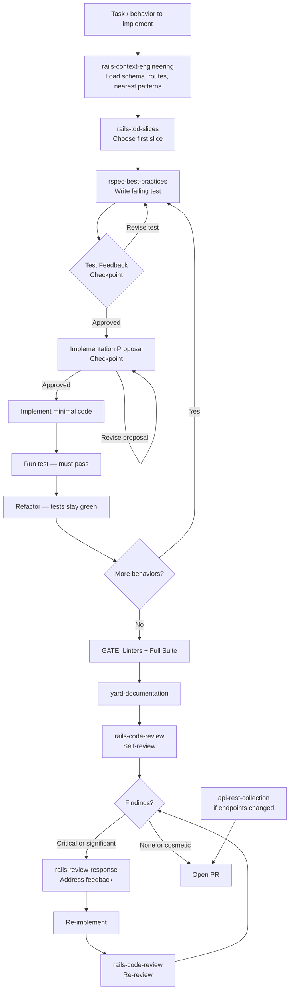

**Step by step:**

1. **rails-context-engineering** — Load the minimum Rails context (schema, routes, nearest pattern, nearest spec). Post the Context Summary before anything else.
2. **rails-tdd-slices** — Choose the highest-value first failing spec (request, service, model, job).
3. **rspec-best-practices** — Write the failing test and run it.
4. **Test Feedback Checkpoint** — Present the test. Confirm: right behavior? right boundary? edge cases? Only proceed when approved.
5. **Implementation Proposal Checkpoint** — Propose the implementation in plain language (classes, methods, structure). Wait for confirmation before writing code.
6. **Implement** — Write the minimum code to pass the test. Run. Refactor. Repeat for each behavior.
7. **GATE: Linters + Full Test Suite** — Run linters (`bundle exec [linter]` or equivalent) and the full suite. Fix all failures before proceeding.
8. **yard-documentation** — Document new or changed public API.
9. **rails-code-review** — Self-review the full branch diff.
10. **rails-review-response** — When feedback is received: evaluate, push back if wrong, implement one item at a time.
11. **Re-review** — After Critical or significant findings are addressed, re-review before merging.
12. **api-rest-collection** — If the change adds or modifies API endpoints, update the collection.

**Key rules:**
- Test Feedback and Implementation Proposal checkpoints are not optional — they prevent wasted implementation cycles
- Linters + suite gate runs before YARD, not after
- Re-review is mandatory when any Critical finding was addressed

---

## Planning a New Feature

```mermaid
flowchart LR
    A[Feature idea] --> CE[rails-context-engineering]
    CE --> B[create-prd]
    B --> C[User reviews PRD]
    C --> D[generate-tasks]
    D --> E[rails-tdd-slices]
    E --> F[TDD Feature Loop]
    F --> G[yard-documentation]
    G --> H[README diagrams docs]
    H --> I[rails-code-review then PR]
```

1. **create-prd**: Describe the feature. The skill generates a PRD with goals, user stories, functional requirements, and success metrics. Saved to `/tasks/prd-[feature-name].md`.

2. **generate-tasks**: Point to the PRD. The skill breaks it into parent tasks and sub-tasks with exact file paths, including **YARD**, **documentation updates**, and **code review before PR**. It can also produce a phased plan when the user wants strategy first. Saved to `/tasks/tasks-[feature-name].md`.

3. **rails-tdd-slices**: Choose the highest-value first failing spec before implementation starts.

4. **TDD Feature Loop**: Follow the primary workflow above for each behavior in the task list.

5. **yard-documentation**: Add or update YARD on every new or changed public class/method (English).

6. **Docs**: Update README, architecture diagrams, and any domain docs affected by the change.

7. **rails-code-review**: Self-review the full diff, then open the PR (use security/architecture skills when needed).

**Key rules:**

- Do NOT implement until the PRD is approved
- Each sub-task should take 2-5 minutes
- Task 0.0 is always "Create feature branch"
- Do not skip YARD, doc updates, or self-review — they are explicit task parents, not optional polish

## DDD-First Feature Design

Use this workflow when the hard part is the **domain itself**: unclear business language, conflicting meanings, fuzzy ownership, or uncertainty about whether something belongs in a model, value object, or service.

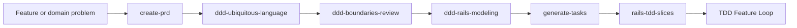

1. **create-prd**: Capture the feature outcome, goals, non-goals, and business rules first.
2. **ddd-ubiquitous-language**: Build the glossary, choose canonical terms, and surface overloaded words.
3. **ddd-boundaries-review**: Check whether the feature crosses bounded contexts, leaks language, or hides ownership problems.
4. **ddd-rails-modeling**: Decide the Rails-first tactical design: model, value object, service, repository, event, or simpler alternative.
5. **generate-tasks**: Turn the design into an implementation plan or detailed checklist.
6. **rails-tdd-slices**: Choose the best first failing spec before code is written.
7. **TDD Feature Loop**: Follow the primary workflow for each behavior.

**Key rules:**

- Start with language and invariants, not patterns
- Do not introduce repositories or domain events unless the boundary pressure is real
- Prefer the smallest credible boundary improvement over a DDD rewrite
- Chain back to `rails-architecture-review` or `refactor-safely` when the domain problem lives in existing code structure

### Optional: tickets from the plan (tool-agnostic)

When the team tracks work in **any issue tracker** (Jira, Linear, GitHub Issues, Azure DevOps, etc.), run **ticket-planning** after **generate-tasks** (or from any approved initiative plan):

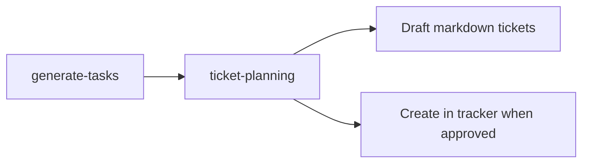

- Use it for **draft-only** output (markdown tickets, classification, sprint buckets) or **create in your tracker** after the user confirms project/workspace, issue types, and fields for that tool.
- It does not replace the PRD/tasks artifacts; it **maps** planning output to board-ready tickets.

---

## Where principles apply in the flow

**After** the **tests gate** is satisfied for a given behavior, **implementation** should follow:

1. **rails-code-conventions** — DRY/YAGNI/PORO/CoC/KISS; project linter as style SoT; structured logging; rules by path (`app/services`, workers, controllers, etc.).
2. **rails-stack-conventions** — Stack-specific defaults (PostgreSQL, Hotwire, Tailwind).

Use **rails-code-conventions** during **code review** and **refactors** as well, not only on greenfield features.

When the main issue is domain language or ownership, run `ddd-ubiquitous-language` and `ddd-boundaries-review` before deciding on Rails tactical modeling.

---

## Code Review and Feedback Loop

**Before opening a PR:** run **rails-code-review** on your own branch (same checklist as reviewing others). Task lists from **generate-tasks** end with this step.

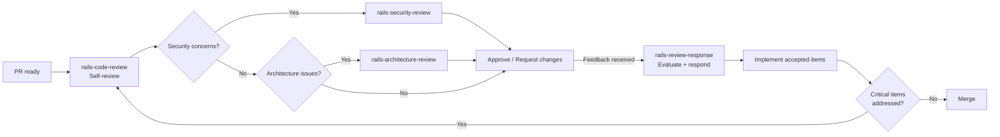

1. **rails-code-review**: Systematic review across routing, controllers, models, queries, migrations, security, caching, and testing.
2. **rails-security-review**: Deep dive on auth, params, redirects, output encoding, and secrets.
3. **rails-architecture-review**: Structural review of boundaries, responsibilities, and abstraction quality.
4. **rails-review-response**: When review feedback is received — evaluate, push back if wrong, implement one item at a time.

**Key rules:**

- Use severity levels: Critical / Suggestion / Nice to have
- When receiving feedback: use **rails-review-response** — verify before implementing, no performative agreement
- Re-review is mandatory after any Critical finding is addressed

---

## Bug Fix

Bug triage and bug fix are two distinct phases:

- **Bug triage** (`rails-bug-triage`) = diagnosing and reproducing the bug, producing a failing spec
- **Bug fix** = implementing the minimal safe change to make that spec pass — this follows the standard TDD gate, not a separate skill

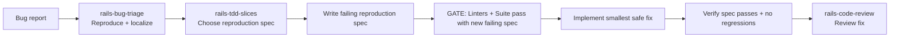

1. **rails-bug-triage**: Clarify expected vs actual behavior, narrow the affected layer, identify the highest-value reproduction path.
2. **rails-tdd-slices**: Decide the strongest first failing spec for the bug.
3. **Write failing reproduction spec**: The spec must fail for the bug reason, not a setup error.
4. **Implement**: Smallest safe fix. No scope creep, no premature abstraction.
5. **rails-code-review**: Review and merge.

**Key rules:**
- Bug triage produces a failing spec — the fix is the TDD loop applied to that spec
- No fix without a failing spec first
- Minimum safe change only — do not refactor while fixing

---

## Writing Tests (TDD)

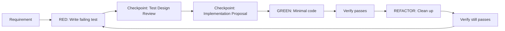

1. **rails-tdd-slices**: Use first when the right starting spec is not obvious. It helps pick the best initial failing spec for request, model, service, job, engine, or bug-fix work.

2. **rspec-best-practices**: Covers the full TDD cycle, spec type selection, factory design, and common smells. Includes the Test Feedback and Implementation Proposal checkpoints.

3. **rspec-service-testing**: Specific patterns for service object tests — instance_double, hash factories, shared_examples.

**Key rules:**

- No production code without a failing test first
- If code exists before the test, delete it and start over
- Test Feedback checkpoint: present the test before implementing — confirm behavior, boundary, edge cases
- Implementation Proposal checkpoint: propose the approach before writing code — confirm structure
- Run tests after EVERY step

---

## Performance Optimization

Use when slow queries, N+1s, profiling, caching, or response time regressions are identified.

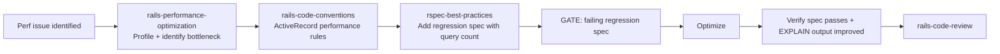

1. **rails-performance-optimization**: Profile first — identify the bottleneck (N+1, slow query, cache miss, allocation). Decide intervention (eager load, index, fragment cache, background move).
2. **rails-code-conventions**: Apply the ActiveRecord performance section (`app/models/**/*.rb`) — eager loading, `exists?`, `pluck`, `find_each`.
3. **rspec-best-practices**: Add a regression spec with a query count assertion (`make_database_queries(count: N)`) before optimizing.
4. **Optimize**: Apply the fix — `includes`, `preload`, `eager_load`, index, or query rewrite.
5. **rails-code-review**: Review before merging.

**Key rules:**
- Write the regression spec first — it proves the optimization worked and prevents future regressions
- Use `EXPLAIN ANALYZE` to confirm query plan improvement, not just timing
- Treat GraphQL N+1 as Critical (see **rails-graphql-best-practices**)

---

## Authorization (Roles & Permissions)

Use when adding or reviewing roles, permissions, or policy objects (Pundit, CanCanCan, custom policy services).

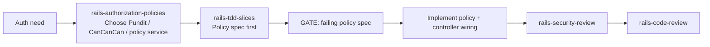

1. **rails-authorization-policies**: Decide the right tool, define roles/permissions matrix, plan policy objects per resource.
2. **rails-tdd-slices**: Start from the policy spec (allow/deny per role), then controller request specs.
3. **rails-security-review**: IDOR, privilege escalation, and missing controller authorization checks.

**Key rules:**
- Policies are objects, not controller `before_action` puzzles
- Default-deny: every action must be explicitly authorized
- Test allow AND deny per role — both branches matter

---

## Frontend (Hotwire / Turbo / Stimulus)

Use when adding Turbo Frames, Turbo Streams, Stimulus controllers, or upgrading interactions to Hotwire.

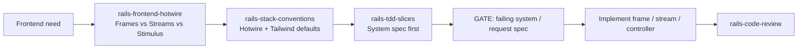

1. **rails-frontend-hotwire**: Pick Frame, Stream, or Stimulus per interaction; define broadcast triggers and target IDs.
2. **rails-stack-conventions**: Stick to Hotwire + Tailwind defaults — no SPA frameworks unless justified.
3. **rails-tdd-slices**: System spec for user-visible behavior; request spec for stream broadcast assertions.

**Key rules:**
- Prefer Frames over Streams unless server-pushed updates are required
- Stimulus controllers stay thin — heavy logic belongs in services or models
- Keep DOM IDs stable across partials so Streams target reliably

---

## REST API Versioning

Use when adding `v1`/`v2` namespaces, deprecating endpoints, or planning a contract change.

1. **rails-api-versioning**: Choose the strategy (URL `:api_version`, `Accept` header, subdomain). Plan the deprecation window and the parallel-run period.
2. **api-rest-collection**: Update or fork the Postman collection per version.
3. **rails-code-review**: Verify back-compat shim, deprecation headers, and changelog entry.

**Key rules:**
- Never break a public version in place — branch first, deprecate next
- Communicate deprecation via response header (`Sunset`, `Deprecation`) before removal
- Keep one canonical version live at a time as the "default" if no version is requested

---

## Development & Test Data (Seeds vs Fixtures)

Use when designing data for `bin/rails db:seed`, RSpec fixtures, or factories.

1. **rails-database-seeding**: Decide seeds vs fixtures vs factories per use case (demo data → seeds; deterministic test rows → fixtures; flexible per-spec data → factories).
2. **rspec-best-practices**: Factories must produce minimal valid records; avoid global state.

**Key rules:**
- Seeds are idempotent — running twice does not create duplicates
- Never seed real PII or production-like secrets in dev
- Fixtures and factories solve different problems; do not pick one to "ban" the other

---

## Project Onboarding (First-time Dev Environment)

Use when bringing a new developer onto an existing Rails app.

1. **rails-project-onboarding**: Walk Docker / docker-compose, env vars, credentials, database create/migrate/seed, test suite, linters, IDE setup.
2. **rails-context-engineering**: After environment is green, load schema/routes/nearest patterns before the first code change.

**Key rules:**
- Onboarding is not optional — finish it before opening a PR
- Document every drift discovered during onboarding back into the README so the next developer hits less friction

---

## Database Migration Safety

Use when adding, modifying, or removing columns, indexes, or tables — especially on large tables.

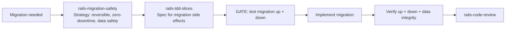

1. **rails-migration-safety**: Plan the strategy — is it reversible? Does it need a phased rollout? Are there zero-downtime constraints?
2. **rails-tdd-slices**: Choose a spec for the migration side effects (e.g. column default, data backfill result, index existence).
3. **Implement**: Write the migration following the agreed strategy.
4. **Verify**: Test `up`, `down`, and any data integrity checks.
5. **rails-code-review**: Review before merging.

**Key rules:**
- Never combine schema changes and data backfills in the same migration
- Always test `down` — reversibility is not optional
- On large tables: separate migration for `algorithm: :concurrent` indexes

---

## Security Review

Use when security-sensitive changes are made, or as a standalone audit of any endpoint or auth flow.

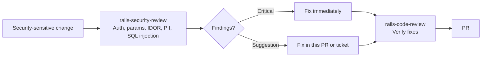

1. **rails-security-review**: Full audit of auth, strong params, IDOR, PII exposure, SQL injection, CSRF, XSS, and secrets handling.
2. Categorize: Critical (fix before merge) vs Suggestion (fix or ticket).
3. **rails-code-review**: Verify fixes are correct and complete.

**Key rules:**
- Security review is a standalone trigger — not only when code review happens to find something
- Critical security findings block merge
- Never store secrets in code, logs, or version control

---

## GraphQL Feature

Use when adding or modifying GraphQL queries, mutations, types, or resolvers.

```mermaid
flowchart LR
    A[GraphQL feature] --> B[create-prd]
    B --> C[ddd-ubiquitous-language\nType / field naming]
    C --> D[rails-graphql-best-practices\nSchema design]
    D --> E[rails-tdd-slices\nChoose first spec]
    E --> F[TDD Feature Loop]
    F --> G[rails-migration-safety\nif DB changes needed]
    G --> H[rails-code-conventions]
    H --> I[rails-security-review\nintrospection, auth, depth limits]
    I --> J["GATE: Linters + Suite"]
    J --> K[yard-documentation]
    K --> L[rails-code-review → PR]
```

1. **ddd-ubiquitous-language**: Type and field names must match domain language.
2. **rails-graphql-best-practices**: Schema design — types, mutations, N+1 prevention, authorization, error shape.
3. **rails-tdd-slices**: Choose first spec (mutation spec, query spec, or resolver unit).
4. **TDD Feature Loop**: Standard implementation cycle.
5. **rails-security-review**: Introspection disabled, field-level auth, query depth/complexity limits.

**Key rules:**
- Every resolver that calls an association must use a dataloader
- Mutations always return `{ result, errors }` — never raise
- Disable introspection in production
- Use Insomnia or GraphQL Playground for API testing — not Postman REST collections

---

## Building a Rails Engine

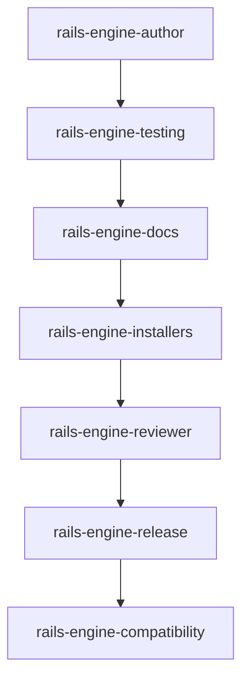

1. **rails-engine-author**: Choose engine type, set up namespace isolation, define host contract.
2. **rails-engine-testing**: Create dummy app, add request/routing/generator specs.
3. **rails-engine-docs**: Write README with installation, mounting, configuration, usage (all in English).
4. **rails-engine-installers**: Create idempotent install generators.
5. When the engine exposes HTTP endpoints, use **api-rest-collection** to generate or update a Postman Collection (JSON v2.1) for testing.
6. **rails-engine-reviewer**: Review the complete engine for quality.
7. **rails-engine-release**: Prepare versioned release with changelog.

---

## Documentation and API Testing

**Generated output:** All documentation, YARD comments, Postman collections, and examples must be in **English** unless the user explicitly requests another language.

**Post-implementation (not optional for features):** After implementation and green tests, **yard-documentation** runs on the touched public API; then update **README**, **diagrams** (e.g. Mermaid in `docs/`), and **related domain docs** so operators and future developers see the new behavior.

1. **yard-documentation**: Use when writing or reviewing inline docs for Ruby classes and public methods. Apply YARD tags (`@param`, `@option`, `@return`, `@raise`, `@example`) on every public method; keep all text in English. **Required before PR** for new or changed public API.
2. **api-rest-collection**: Use when creating or modifying REST API endpoints (Rails controllers, engine routes). Generate or update a Postman Collection JSON (v2.1) so the flow can be tested; store it in e.g. `docs/postman/` or `spec/fixtures/postman/`. Request names and descriptions in English. **Note:** For GraphQL endpoints, prefer Insomnia or GraphQL Playground — Postman REST collections do not map cleanly to GraphQL queries and mutations.

---

## Extracting to an Engine

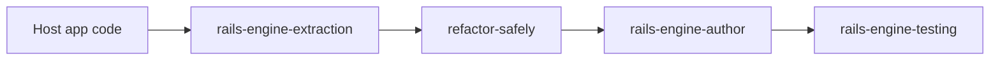

1. **rails-engine-extraction**: Identify bounded feature, list host dependencies, create adapters.
2. **refactor-safely**: Characterization tests first, then extract in small steps.
3. **rails-engine-author**: Scaffold the engine properly.
4. **rails-engine-testing**: Verify behavior is preserved.

**Key rules:**

- Do NOT extract and change behavior in the same step
- Add characterization tests before any extraction
- Use adapters for host dependencies

---

## Creating Service Objects

1. **ruby-service-objects**: Follow `.call` pattern, standardized responses, YARD docs (see **yard-documentation**), transaction wrapping.
2. **rspec-service-testing**: Test with subject/let, instance_double, change matchers, error scenarios.

For inline documentation standards, use **yard-documentation**. For external API integrations, add **ruby-api-client-integration** (Auth/Client/Fetcher/Builder layers).

For variant-based calculators, add **strategy-factory-null-calculator** (Factory + Strategy + Null Object).

---

## External API Integration

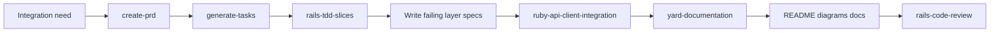

1. **create-prd**: Capture the business need, external dependency, side effects, and success criteria.
2. **generate-tasks**: Break the integration into layers and explicit verification steps.
3. **rails-tdd-slices**: Decide the strongest first failing spec, usually at the auth, client, fetcher, builder, or mapping boundary.
4. **ruby-api-client-integration**: Implement the layered Rails-first client structure with retries, pagination, token handling, and domain mapping where needed.
5. **yard-documentation**: Document public Ruby API exposed by the integration layer.
6. **Docs**: Update README and any operator or integration docs affected by setup, credentials flow, or usage.
7. **rails-code-review**: Review reliability, layering, and failure handling before PR.

**Key rules:**

- Start with a failing spec for the riskiest layer, not with ad-hoc request code
- Keep auth, transport, fetching, and mapping responsibilities explicit
- Prefer domain mapping over leaking raw external payloads deep into the app
- Document setup and operational expectations when the integration changes developer or operator workflow

---

## Refactoring Existing Code

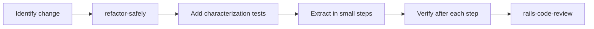

1. **refactor-safely**: Define stable behavior, add characterization tests, extract one boundary at a time.
2. **rspec-best-practices**: Write the tests that protect the refactoring.
3. **rails-code-review**: Review the refactored code.

**Key rules:**

- Separate behavior changes from structural changes
- Verify tests pass after EVERY refactoring step
- Evidence before claims — run the test suite, don't assume
