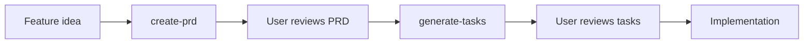
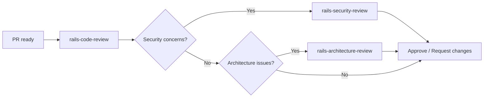
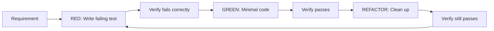
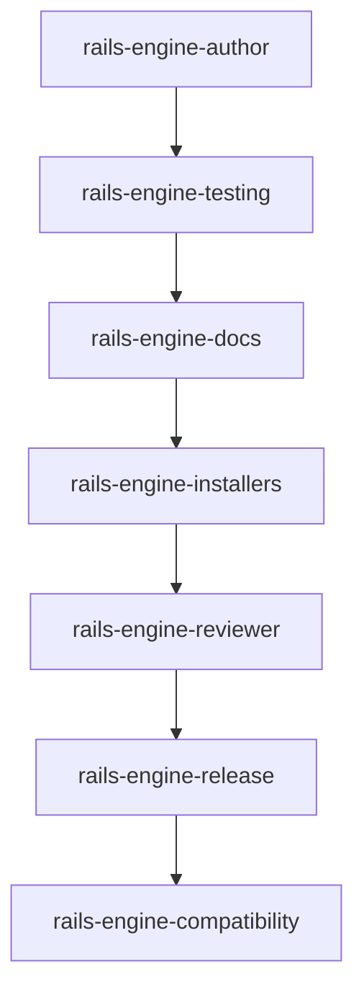
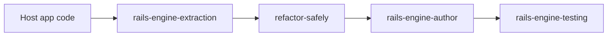
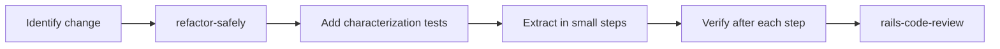

# Workflow Guide

How to use skills in typical Rails development workflows.

## Cross-Cutting Rule: Tests Gate Implementation

**Tests are a gate between planning and code.** Once a PRD and tasks exist, the test for each behavior must be written, run, and validated as failing BEFORE any implementation code is written.

```
PRD → Tasks → [GATE: Write test → Run test → Verify it fails] → Implementation → Verify it passes
```

The gate is non-negotiable. Implementation code cannot exist before its test has been:
1. Written and saved
2. Executed
3. Confirmed failing because the feature does not exist yet

See **rspec-best-practices** for the full gate cycle.

## Planning a New Feature



1. **create-prd**: Describe the feature. The skill generates a PRD with goals, user stories, functional requirements, and success metrics. Saved to `/tasks/prd-[feature-name].md`.

2. **generate-tasks**: Point to the PRD. The skill breaks it into parent tasks and sub-tasks with exact file paths. Saved to `/tasks/tasks-[feature-name].md`.

3. **Implementation**: Follow the task list, checking off items as you go.

**Key rules:**
- Do NOT implement until the PRD is approved
- Each sub-task should take 2-5 minutes
- Task 0.0 is always "Create feature branch"

---

## Code Review



1. **rails-code-review**: Systematic review across routing, controllers, models, queries, migrations, security, caching, and testing.

2. **rails-security-review**: Deep dive on auth, params, redirects, output encoding, and secrets.

3. **rails-architecture-review**: Structural review of boundaries, responsibilities, and abstraction quality.

**Key rules:**
- Use severity levels: Critical / Suggestion / Nice to have
- When receiving feedback: verify before implementing, no performative agreement
- Push back with technical reasoning when feedback is incorrect

---

## Writing Tests (TDD)



1. **rspec-best-practices**: Covers the full TDD cycle, spec type selection, factory design, and common smells.

2. **rspec-service-testing**: Specific patterns for service object tests — instance_double, hash factories, shared_examples.

**Key rules:**
- No production code without a failing test first
- If code exists before the test, delete it and start over
- Run tests after EVERY step

---

## Building a Rails Engine



1. **rails-engine-author**: Choose engine type, set up namespace isolation, define host contract.
2. **rails-engine-testing**: Create dummy app, add request/routing/generator specs.
3. **rails-engine-docs**: Write README with installation, mounting, configuration, usage.
4. **rails-engine-installers**: Create idempotent install generators.
5. **rails-engine-reviewer**: Review the complete engine for quality.
6. **rails-engine-release**: Prepare versioned release with changelog.

---

## Extracting to an Engine



1. **rails-engine-extraction**: Identify bounded feature, list host dependencies, create adapters.
2. **refactor-safely**: Characterization tests first, then extract in small steps.
3. **rails-engine-author**: Scaffold the engine properly.
4. **rails-engine-testing**: Verify behavior is preserved.

**Key rules:**
- Do NOT extract and change behavior in the same step
- Add characterization tests before any extraction
- Use adapters for host dependencies

---

## Creating Service Objects

1. **ruby-service-objects**: Follow `.call` pattern, standardized responses, YARD docs, transaction wrapping.
2. **rspec-service-testing**: Test with subject/let, instance_double, change matchers, error scenarios.

For external API integrations, add **ruby-api-client-integration** (Auth/Client/Fetcher/Builder layers).

For variant-based calculators, add **strategy-factory-null-calculator** (Factory + Strategy + Null Object).

---

## Refactoring Existing Code



1. **refactor-safely**: Define stable behavior, add characterization tests, extract one boundary at a time.
2. **rspec-best-practices**: Write the tests that protect the refactoring.
3. **rails-code-review**: Review the refactored code.

**Key rules:**
- Separate behavior changes from structural changes
- Verify tests pass after EVERY refactoring step
- Evidence before claims — run the test suite, don't assume
