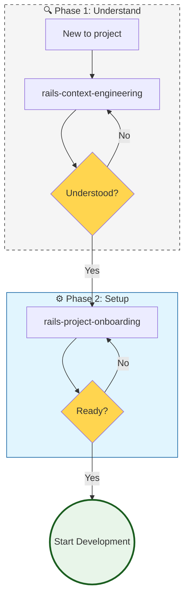

# Workflow: Discovery & Context (00)

**When to use:** New to a project, need to understand the codebase, or setting up development environment.

---

## Main Flow: New Developer on Project



---

## Step 1: rails-context-engineering

**Goal:** Load the minimum context needed before writing code, tests, or PRDs.

**What it does:**
1. Inspects `db/schema.rb` — data structure
2. Reads `config/routes.rb` — HTTP surface
3. Finds neighboring models, controllers, services
4. Reads existing factories and specs
5. Detects ambiguities between requirements and code

**Output:** Context Summary posted before any code proposal.

**When to invoke:**
- "Before I code on this, what's the existing pattern?"
- "Where is this defined in the codebase?"
- "Match existing style"

---

## Step 2: rails-project-onboarding (NEW)

**Goal:** Complete development environment setup.

### Onboarding Checklist

- [ ] **Repository cloned** and structure understood
- [ ] **Docker / docker-compose** configured (if applicable)
- [ ] **Environment variables** set up (.env, credentials)
- [ ] **Database** created, migrated, seeded
- [ ] **Test suite** running locally
- [ ] **Linters** installed and configured
- [ ] **IDE/Editor** configured (Ruby LSP, plugins)
- [ ] **Git hooks** installed (pre-commit, etc.)
- [ ] **Documentation** read (README, ARCHITECTURE.md)

### Standard Rails App Structure

```text
app/
├── controllers/      # HTTP layer, thin
├── models/          # Domain logic + persistence
├── services/        # Business operations
├── jobs/            # Background processing
├── views/           # ERB/HAML + Hotwire
└── helpers/         # View utilities

config/
├── routes.rb        # Routing table
└── initializers/    # Gem configs

spec/ or test/
├── models/          # Unit tests
├── requests/        # Integration tests
├── services/        # Service tests
└── system/          # E2E tests

docs/
├── architecture.md  # System design
├── api/             # API documentation
└── workflows/       # This directory
```

### Database Setup Commands

```bash
# Standard setup
bin/rails db:create
bin/rails db:migrate
bin/rails db:seed

# Test environment
RAILS_ENV=test bin/rails db:create db:migrate

# With Docker
docker-compose up -d db
docker-compose run web bin/rails db:create db:migrate db:seed
```

### Environment Variables Checklist

| Variable | Purpose | Where to define |
|----------|---------|-----------------|
| `DATABASE_URL` | DB connection | `.env` / env vars |
| `REDIS_URL` | Cache/Sidekiq | `.env` |
| `RAILS_MASTER_KEY` | Encrypted credentials | env var only (never in repo) |
| `AWS_*` / `S3_*` | Storage | credentials.yml.enc |
| `SENDGRID_*` | Email | credentials.yml.enc |
| `STRIPE_*` | Payments | credentials.yml.enc |

---

## Integration with Next Steps

| If you need... | Next skill |
|----------------|------------|
| To plan a feature | `create-prd` → [10-planning](10-planning.md) |
| To start coding | `rails-tdd-slices` → [30-development](30-development.md) |
| To fix a bug | `rails-bug-triage` → [30-development#bug-fix](30-development.md) |
| To configure CI/CD | *(roadmap — `rails-ci-cd-setup`, see [20-setup](20-setup.md))* |

---

## Hard Gate: No Code Without Context

```text
DO NOT write implementation code before running rails-context-engineering.
ALWAYS post the Context Summary and resolve any ambiguities first.
```

---

## Skills in this Workflow

| Skill | Description | Trigger words |
|-------|-------------|---------------|
| **rails-context-engineering** | Load context before coding | "load context", "before I code", "match existing style" |
| **rails-project-onboarding** | Dev environment setup | "onboarding", "new dev", "setup project", "Docker" |
