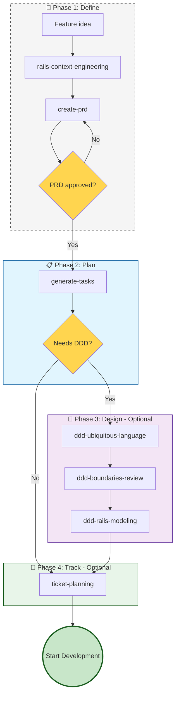

# Workflow: Planning & Design (10)

**When to use:** You are building a new feature and need to plan before coding.

---

## Main Flow: Standard Planning



---

## Step 1: create-prd

**Goal:** Define the feature before implementing.

**Output:** `/tasks/prd-[feature-name].md` with:
- Goals and non-goals
- User stories
- Functional requirements
- Success metrics
- Open questions

**Gate:** Do not implement until PRD is approved.

---

## Step 2: generate-tasks

**Goal:** Convert PRD into TDD-ready tasks.

**Output:** `/tasks/tasks-[feature-name].md` with:
- Task 0.0: Create feature branch
- TDD task groups (4 sub-tasks each)
- YARD documentation task
- README/docs update task
- Code review gate

**Rules:**
- Each sub-task: 2-5 minutes
- All file paths are exact
- No scope creep

---

## Step 3 (optional): DDD-First Design

When the problem is the **domain itself**: ambiguous language, confusing ownership, or uncertainty about where logic belongs.

### DDD Sequence

1. **ddd-ubiquitous-language**: Glossary, canonical terms, overloaded words
2. **ddd-boundaries-review**: Bounded contexts, language leakage, ownership
3. **ddd-rails-modeling**: Model, value object, service, repository, event — or simpler alternative

**Key rules:**
- Start with language and invariants, not patterns
- Do not introduce repositories or domain events without real boundary pressure
- Prefer the smallest credible boundary improvement over DDD rewrite

---

## Step 4 (optional): ticket-planning

When the team uses an issue tracker (Jira, Linear, GitHub Issues).

**Goal:** Map planning output to board-ready tickets.

**Does not replace:** PRD/tasks artifacts. It is an additional mapping.

---

## Integration with Development

| Planning output | Next step |
|-----------------|-----------|
| Tasks ready | `rails-tdd-slices` → [30-development](30-development.md) |
| Need additional architecture | `rails-architecture-review` → [50-review](50-review.md) |
| Need migration | `rails-migration-safety` → [30-development](30-development.md) |

---

## Skills in this Workflow

| Skill | Description | Trigger words |
|-------|-------------|---------------|
| **create-prd** | Write requirements document | "plan feature", "create PRD", "requirements" |
| **generate-tasks** | Break PRD into TDD tasks | "break into tasks", "implementation plan", "task list" |
| **ticket-planning** | Create tracker tickets | "create tickets", "Jira", "Linear", "GitHub Issues" |
| **ddd-ubiquitous-language** | Domain language glossary | "domain terms", "ubiquitous language", "what should we call this" |
| **ddd-boundaries-review** | Bounded context review | "context boundaries", "language leakage", "ownership" |
| **ddd-rails-modeling** | DDD → Rails mapping | "aggregate", "value object", "domain event", "repository" |

---

## Planning Flows

### Standard Feature
```
rails-context-engineering → create-prd → generate-tasks → rails-tdd-slices
```

### Feature with DDD
```
rails-context-engineering → create-prd → ddd-ubiquitous-language → ddd-boundaries-review → ddd-rails-modeling → generate-tasks → rails-tdd-slices
```

### Planning with Tickets
```
create-prd → generate-tasks → ticket-planning → tracker
```

---

## Key Gates

```text
DO NOT implement until PRD is approved.
DO NOT generate tasks until PRD is stable.
DO NOT skip DDD phase when domain language is fuzzy.
```
