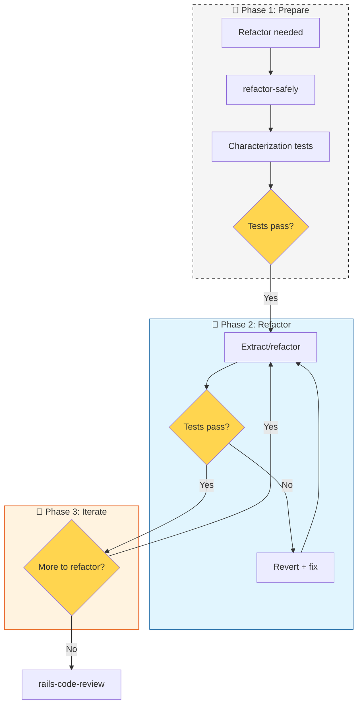

# Workflow: Code Quality (40)

**When to use:** Apply conventions, refactor existing code, or maintain quality during development.

---

## Main Flow: Refactoring



---

## refactor-safely

**Goal:** Change structure without changing behavior.

### Steps

1. **Characterization tests:** Write tests that document current behavior
2. **Verify tests pass:** On current code
3. **Extract/modify:** One boundary at a time
4. **Verify:** Tests pass after each change

**Key rule:** Separate behavior changes from structural changes. Never both.

---

## rails-code-conventions

**Goal:** Clean code following Rails principles.

### Daily Checklist

| Path | Rules |
|------|-------|
| `app/controllers` | Thin controllers, 1 line actions, strong params |
| `app/models` | No complex business logic, scopes for queries |
| `app/services` | `.call` pattern, response contract, YARD |
| `app/jobs` | Idempotency, retry strategy, log context |
| `config/routes` | Resourceful, shallow nesting |

### Principles

- **DRY** — Don't Repeat Yourself
- **YAGNI** — You Ain't Gonna Need It
- **PORO** — Plain Old Ruby Objects for complex logic
- **CoC** — Convention over Configuration
- **KISS** — Keep It Simple, Stupid

---

## yard-documentation

**Goal:** Document public API after implementation.

### When to use

- New public class method
- New public class
- Change to existing method signature

### Required Tags

```ruby
# @param params [Hash] :user_id, :amount
# @return [Hash] { success: Boolean, response: Hash }
# @raise [ArgumentError] when user_id is nil
```

**Language:** All YARD in English unless user requests otherwise.

---

## Skills in this Workflow

| Skill | Description | Trigger words |
|-------|-------------|---------------|
| **refactor-safely** | Restructure preserving behavior | "refactor", "extract", "restructure" |
| **rails-code-conventions** | Clean code principles | "code review", "conventions", "DRY", "YAGNI" |
| **yard-documentation** | Inline API docs | "YARD", "documentation", "@param", "@return" |
