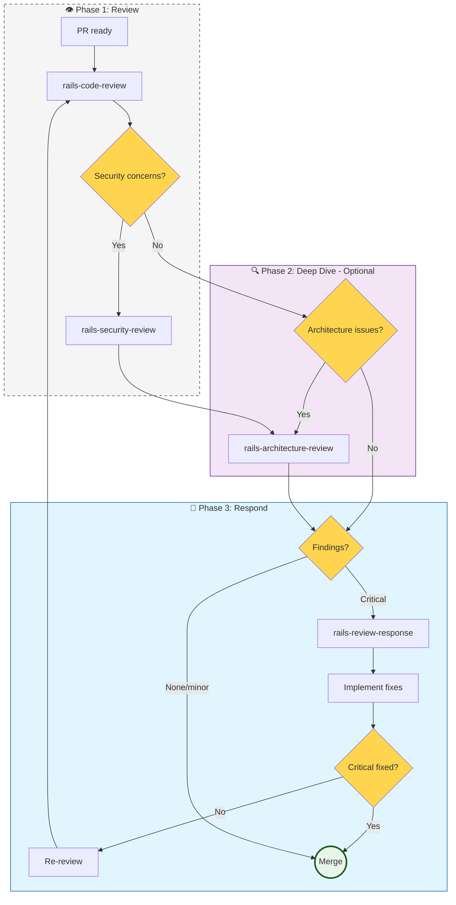

# Workflow: Review & Validation (50)

**When to use:** Review your own or others' code, respond to feedback, or audit security/architecture.

---

## Main Flow: Code Review

---

## rails-code-review

**Goal:** Systematic Rails PR review.

### Checklist by Area

| Area | What to review |
|------|----------------|
| **Routing** | RESTful routes, shallow nesting, route helpers |
| **Controllers** | Thin, 1-line actions, strong params, callbacks audit |
| **Models** | Validations, scopes, callbacks, N+1 queries |
| **Queries** | Eager loading, pluck vs map, exists? vs present? |
| **Migrations** | Reversible, index names, null constraints |
| **Security** | Strong params, auth checks, output encoding |
| **Testing** | Correct spec type, minimal factories, no internal mocks |
| **Jobs** | Idempotency, retry config, log context |

### Severity Levels

| Level | Action |
|-------|--------|
| **Critical** | Blocks merge — fix before merging |
| **Suggestion** | Fix in this PR or separate ticket |
| **Nice to have** | Optional, does not block |

---

## rails-security-review

**Goal:** Deep security dive.

### Audit Checklist

- [ ] **Auth** — Session management, token handling
- [ ] **Authorization** — IDOR, role checks, policy coverage
- [ ] **Input validation** — Strong params, SQL injection
- [ ] **Output encoding** — XSS prevention
- [ ] **Redirects** — Open redirect vulnerabilities
- [ ] **Secrets** — Never in code, logs, or VCS
- [ ] **GraphQL** — Introspection off in prod, depth limits

---

## rails-architecture-review

**Goal:** Structural review of boundaries and abstractions.

### Review Signals

- Feature crosses multiple models without clarity
- Service creates/modifies unrelated models
- Complex callbacks calling other models
- Logic duplicated between controllers

### Output

- Boundary recommendations
- Extraction suggestions
- Coupling assessment

---

## rails-review-response

**Goal:** Respond to received feedback.

### Process

1. **Evaluate** each suggestion — is it correct?
2. **Push back** if wrong — explain why
3. **Implement** accepted items — one at a time
4. **Re-review** mandatory if Critical findings

**Anti-pattern:** "LGTM! Will address in follow-up" — no performative agreement

---

## Skills in this Workflow

| Skill | Description | Trigger words |
|-------|-------------|---------------|
| **rails-code-review** | Systematic PR review | "review PR", "code review", "check this code" |
| **rails-security-review** | Security audit | "security", "audit", "vulnerability", "XSS", "SQL injection" |
| **rails-architecture-review** | Structural review | "architecture", "structure", "boundaries", "extract" |
| **rails-review-response** | Respond to feedback | "feedback", "review comments", "address feedback" |
| **api-rest-collection** | API testing docs | "Postman", "API collection", "REST endpoints" |
