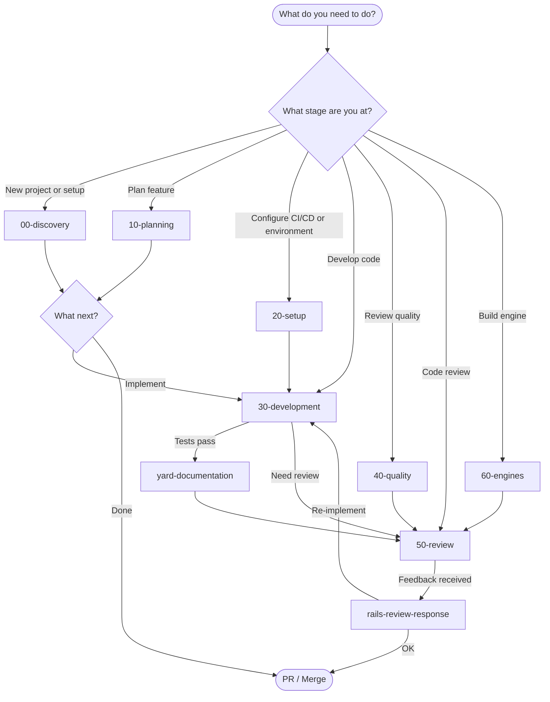

# Workflows — Rails Agent Skills

Step-by-step guides for each stage of Rails development. Each workflow is a chain of skills executed in order.

---

## Master Workflow Diagram



---

## Workflow Index by Stage

| Stage | Workflow | Description | Primary Skills |
|-------|----------|-------------|----------------|
| **00** | [Discovery & Context](00-discovery.md) | Understand codebase, project onboarding | `rails-context-engineering`, `rails-project-onboarding` |
| **10** | [Planning & Design](10-planning.md) | Plan features, PRD, tasks, DDD | `create-prd`, `generate-tasks`, `ddd-*` |
| **20** | [Setup & Configuration](20-setup.md) | Configure CI/CD, environment, deploy | `rails-project-onboarding` *(plus roadmap `rails-ci-cd-setup`)* |
| **30** | [Development](30-development.md) | TDD development, implementation | `rails-tdd-slices`, `rspec-*`, implementation |
| **40** | [Code Quality](40-quality.md) | Conventions, refactoring, documentation | `rails-code-conventions`, `refactor-safely`, `yard-documentation` |
| **50** | [Review & Validation](50-review.md) | Code review, security, architecture | `rails-code-review`, `rails-security-review`, `rails-architecture-review` |
| **60** | [Engine Development](60-engines.md) | Create and maintain Rails engines | `rails-engine-*` |

---

## Specialized Workflows

| Situation | Workflow | Quick Entry |
|-----------|----------|-------------|
| **Bug fix** | [Bug Fix Loop](30-development.md#bug-fix-loop) | `rails-bug-triage` → Fix → Test |
| **Refactoring** | [Refactor Safely](40-quality.md#refactoring) | `refactor-safely` → characterization tests → extract |
| **Performance** | [Performance Optimization](30-development.md#performance-optimization) | `rails-performance-optimization` |
| **GraphQL** | [GraphQL Feature](30-development.md#graphql-feature) | `rails-graphql-best-practices` |
| **Authorization** | [Authorization Setup](30-development.md#authorization) | `rails-authorization-policies` |
| **External API** | [API Integration](30-development.md#external-api-integration) | `ruby-api-client-integration` |

---

## Quick Decision Tree

```
New to the project?
  ├─ Yes → rails-context-engineering → rails-project-onboarding
  └─ No → What do you need to do?

       Plan a feature?
       ├─ Yes → create-prd → generate-tasks → (ticket-planning optional)
       └─ No → Implement?

            Bug or refactor?
            ├─ Bug → rails-bug-triage
            ├─ Refactor → refactor-safely
            └─ New feature → rails-tdd-slices → rspec-best-practices

                 Code type?
                 ├─ Service → ruby-service-objects
                 ├─ REST API → ruby-api-client-integration
                 ├─ GraphQL → rails-graphql-best-practices
                 ├─ Migration → rails-migration-safety
                 ├─ Background job → rails-background-jobs
                 └─ Engine → rails-engine-author

                      Authorization/roles?
                      └─ rails-authorization-policies

                           Performance?
                           └─ rails-performance-optimization
```

---

## Cross-Cutting: Tests Gate Implementation

All code-producing workflows include this gate:

```
Write test → Run test → Verify it FAILS → Implement → Verify it PASSES
```

See details in each specific workflow.

---

## Quick Links

- [Complete Skill Catalog](../reference/skill-catalog.md)
- [Integration Matrix](../reference/integration-matrix.md)
- [Implementation Guide](../implementation-guide.md)
